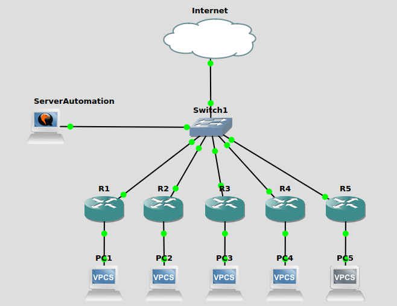

# automation-paramiko-file.txt
Network automation with paramiko, file ip_address.txt, file perintah.txt on 5 device router mikrotik
<h3>Topology</h3>
This repository is tested using this Topology

<h3>Requirement</h3>
To run this repository, you need some python library installed on your computer.
<ul>
    <li>Python 3.6.5</li>
    <li>paramiko</li>
</ul>    
<h3>Setup</h3>
<ol>
    <li>Clone this repository</li>
        <ul>
            <li>git clone https://github.com/verysetiawan/automation-paramiko-file.txt.git</li>
            <li>cd automation-paramiko-file.txt</li>
        </ul>
    <li>Install requirement library</li>
        <ul>
            <li>virtualenv -p python3 auto4env</li>
            <li>source auto4env/bin/activate</li>
            <li>pip install -r requirements.txt</li>
        </ul>
     <li>Editing script ip_address.txt</li>
        <ul>
            <li>open script ip_address.txt with text editor</li>
            <li>change the ip address with yours</li>
       </ul>
    <li>Run the python script</li>
        <ul>
            <li>make sure that file perintah.txt, ip_address.txt are same as location with auto4.py</li>
            <li>python3 auto4.py</li>
        </ul>
